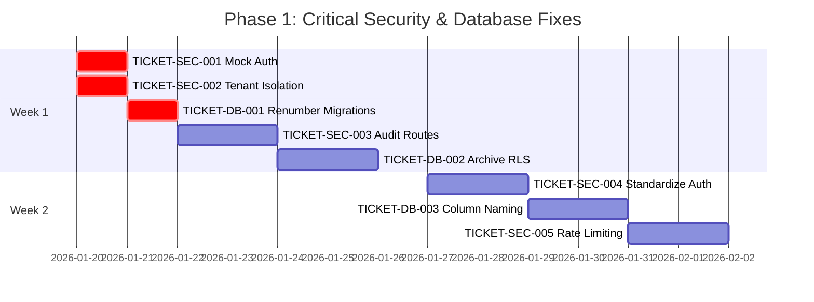
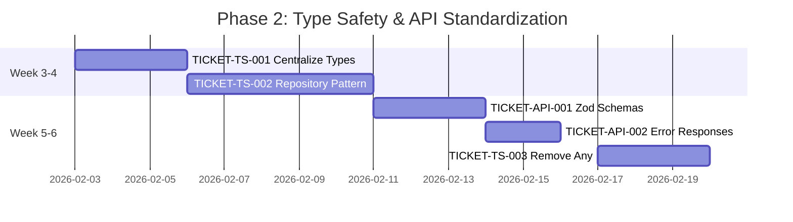
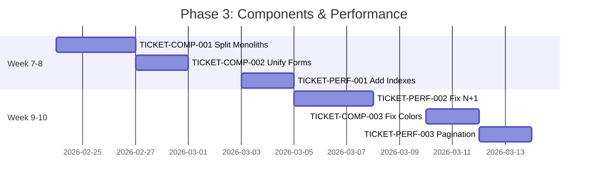
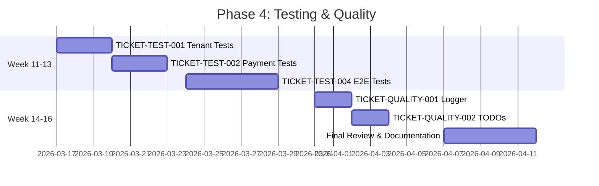

# Technical Debt Remediation Roadmap

**Created**: January 2026  
**Status**: Planning Phase  
**Estimated Total Effort**: 12-16 weeks  
**Team Size**: 2-3 developers

## Overview

This directory contains comprehensive documentation for addressing technical debt discovered in the Vete multi-tenant veterinary platform codebase audit conducted in January 2026.

## Executive Summary

**Codebase Health Score**: 6.5/10

The audit revealed **8 major areas** requiring attention across security, database consistency, type safety, API standardization, component architecture, performance, testing, and code quality.

## Epic Structure

Each epic contains:
- **Overview**: Business impact and technical context
- **Detailed Tickets**: Step-by-step implementation guides
- **Acceptance Criteria**: Clear definition of done
- **Testing Plans**: Comprehensive test scenarios
- **Rollback Plans**: Safety nets for production

---

## Epics Overview

### 🔴 CRITICAL PRIORITY

| Epic | Title | Effort | Risk | Status | Document |
|------|-------|--------|------|--------|----------|
| **EPIC-001** | Security Vulnerabilities & Authentication | 3-5 days | HIGH | Not Started | [EPIC-001-Security-Vulnerabilities.md](./EPIC-001-Security-Vulnerabilities.md) |
| **EPIC-002** | Database Schema Consistency | 1 week | MEDIUM | Not Started | [EPIC-002-Database-Schema-Consistency.md](./EPIC-002-Database-Schema-Consistency.md) |

#### EPIC-001: Security Vulnerabilities & Authentication
**Must fix immediately - blocking production deployment**

**Issues**:
- Mock authentication in user preferences API
- Missing tenant isolation in lost-pets endpoint
- Inconsistent auth patterns across 3 routes
- Missing rate limiting on 15+ mutation endpoints

**Tickets**:
- `TICKET-SEC-001`: Replace Mock Authentication (1 hour) 🔴
- `TICKET-SEC-002`: Add Tenant Isolation to Lost Pets (2 hours) 🔴
- `TICKET-SEC-003`: Audit All API Routes (1 day) 🟡
- `TICKET-SEC-004`: Standardize Auth Pattern (3 hours) 🟡
- `TICKET-SEC-005`: Rate Limiting on Mutations (4 hours) 🟡

---

#### EPIC-002: Database Schema Consistency
**Fix before next major database migration**

**Issues**:
- Duplicate migration numbers (063, 064)
- Missing RLS on archive tables
- Inconsistent naming (`clinic_id` vs `tenant_id`)
- Missing `updated_at` triggers

**Tickets**:
- `TICKET-DB-001`: Renumber Duplicate Migrations (2 hours) 🔴
- `TICKET-DB-002`: Add RLS to Archive Tables (4 hours) 🟡
- `TICKET-DB-003`: Standardize Column Naming (3 hours) 🟡
- `TICKET-DB-004`: Add Missing Audit Triggers (2 hours) 🟡

---

### 🟡 HIGH PRIORITY

| Epic | Title | Effort | Risk | Status | Document |
|------|-------|--------|------|--------|----------|
| **EPIC-003** | TypeScript Type Safety | 2 weeks | LOW | Not Started | [EPIC-003-TypeScript-Type-Safety.md](./EPIC-003-TypeScript-Type-Safety.md) |
| **EPIC-004** | API Standardization | 1.5 weeks | LOW | Not Started | [EPIC-004-API-Standardization.md](./EPIC-004-API-Standardization.md) |
| **EPIC-005** | Component Architecture | 2 weeks | LOW | Not Started | [EPIC-005-Component-Architecture.md](./EPIC-005-Component-Architecture.md) |

#### EPIC-003: TypeScript Type Safety
**Eliminate `any` types and implement proper type system**

**Issues**:
- 52 files with `any` type usage
- 26 instances of `as unknown as` casts
- 6 `@ts-ignore` comments
- 15+ files with inline type definitions

**Tickets**:
- `TICKET-TS-001`: Centralize Entity Types (1 day)
- `TICKET-TS-002`: Implement Repository Pattern (3 days)
- `TICKET-TS-003`: Remove `any` from Infrastructure (2 days)
- `TICKET-TS-004`: Fix Type Assertions (2 days)
- `TICKET-TS-005`: Strict API Type Validation (2 days)

---

#### EPIC-004: API Standardization
**Standardize validation, error handling, and responses**

**Issues**:
- 19+ routes missing Zod validation
- 12+ routes with inconsistent response formats
- Duplicate logic in lost-pets/lost-found routes
- Mixed auth patterns

**Tickets**:
- `TICKET-API-001`: Add Zod Schemas to All Routes (3 days)
- `TICKET-API-002`: Standardize Error Responses (2 days)
- `TICKET-API-003`: Consolidate Lost Pets Routes (1 day)
- `TICKET-API-004`: Implement withApiAuth Everywhere (2 days)

---

#### EPIC-005: Component Architecture Refactoring
**Break monoliths, eliminate duplicates, fix theming**

**Issues**:
- Monolithic component (923 lines)
- Duplicate appointment forms
- Hardcoded colors breaking theme system
- Missing error boundaries

**Tickets**:
- `TICKET-COMP-001`: Split Vaccine Reactions Client (2 days)
- `TICKET-COMP-002`: Unify Appointment Forms (1 day)
- `TICKET-COMP-003`: Replace Hardcoded Colors (2 days)
- `TICKET-COMP-004`: Add Error Boundaries (1 day)
- `TICKET-COMP-005`: Implement Shared Form Hook (2 days)

---

### 🟢 MEDIUM PRIORITY

| Epic | Title | Effort | Risk | Status | Document |
|------|-------|--------|------|--------|----------|
| **EPIC-006** | Performance Optimization | 2 weeks | LOW | Not Started | [EPIC-006-Performance-Optimization.md](./EPIC-006-Performance-Optimization.md) |
| **EPIC-007** | Testing Infrastructure | 3 weeks | LOW | Not Started | [EPIC-007-Testing-Infrastructure.md](./EPIC-007-Testing-Infrastructure.md) |

#### EPIC-006: Performance Optimization
**Fix N+1 queries, add caching, implement pagination**

**Issues**:
- N+1 query patterns in dashboard routes
- Missing pagination on unbounded endpoints
- No Redis caching despite infrastructure
- Unoptimized React Query configuration

**Tickets**:
- `TICKET-PERF-001`: Add Database Indexes (2 days)
- `TICKET-PERF-002`: Fix N+1 Queries (3 days)
- `TICKET-PERF-003`: Implement Pagination (2 days)
- `TICKET-PERF-004`: Configure React Query Caching (1 day)
- `TICKET-PERF-005`: Add Redis Caching Layer (2 days)

---

#### EPIC-007: Testing Infrastructure
**Add comprehensive test coverage**

**Issues**:
- Payment processing: 0% coverage
- Multi-tenant isolation: minimal tests
- Ambassador referrals: no tests
- Missing integration tests

**Tickets**:
- `TICKET-TEST-001`: Multi-Tenant Isolation Tests (3 days)
- `TICKET-TEST-002`: Payment Processing Tests (3 days)
- `TICKET-TEST-003`: Ambassador Program Tests (2 days)
- `TICKET-TEST-004`: E2E Critical Flows (5 days)
- `TICKET-TEST-005`: Test Utilities Cleanup (2 days)

---

### ⚪ LOW PRIORITY

| Epic | Title | Effort | Risk | Status | Document |
|------|-------|--------|------|--------|----------|
| **EPIC-008** | Code Quality & Maintenance | 1 week | LOW | Not Started | [EPIC-008-Code-Quality.md](./EPIC-008-Code-Quality.md) |

#### EPIC-008: Code Quality & Maintenance
**Clean up console.logs, TODOs, establish standards**

**Issues**:
- 23 console.log statements in production code
- 15+ unresolved TODOs
- No automated code quality checks
- Missing documentation

**Tickets**:
- `TICKET-QUALITY-001`: Replace console.log with Logger (1 day)
- `TICKET-QUALITY-002`: Address TODO Comments (2 days)
- `TICKET-QUALITY-003`: Add Pre-commit Hooks (1 day)
- `TICKET-QUALITY-004`: Establish Coding Standards (1 day)

---

## Implementation Timeline

### Phase 1: Critical Fixes (Weeks 1-2)
**Must complete before any production deployment**



### Phase 2: Type Safety & API Cleanup (Weeks 3-6)
**Improve maintainability and developer experience**



### Phase 3: Component & Performance (Weeks 7-10)
**User-facing improvements and optimization**



### Phase 4: Testing & Quality (Weeks 11-16)
**Long-term stability and maintainability**



---

## Prioritization Framework

### Decision Matrix

```
           │ High Impact │ Medium Impact │ Low Impact
───────────┼─────────────┼───────────────┼────────────
High Effort│   P1        │      P2       │     P4
───────────┼─────────────┼───────────────┼────────────
Med Effort │   P0        │      P1       │     P3
───────────┼─────────────┼───────────────┼────────────
Low Effort │   P0        │      P1       │     P2
```

**P0 (Critical)**: Do immediately
- TICKET-SEC-001, TICKET-SEC-002 (security holes)
- TICKET-DB-001 (blocks migrations)

**P1 (High)**: Do in Phase 1-2
- Most security and database tickets
- Type safety foundational work

**P2 (Medium)**: Do in Phase 3
- Component refactoring
- Performance optimizations

**P3 (Low)**: Do in Phase 4
- Code quality cleanup
- Documentation

**P4 (Defer)**: Backlog
- Nice-to-have improvements
- Non-critical optimizations

---

## Metrics & Success Criteria

### Code Quality Metrics

| Metric | Current | Target | Status |
|--------|---------|--------|--------|
| Type Safety | 60% | 95% | 🔴 |
| Test Coverage | 40% | 80% | 🔴 |
| API Auth Coverage | 95% | 100% | 🟡 |
| Component Size (avg) | 180 lines | <150 lines | 🟡 |
| Database RLS Coverage | 92% | 100% | 🟡 |
| Console.log Count | 23 | 0 | 🔴 |

### Epic Completion Tracking

```
EPIC-001: ▱▱▱▱▱▱▱▱▱▱  0% (0/5 tickets)
EPIC-002: ▱▱▱▱▱▱▱▱▱▱  0% (0/4 tickets)
EPIC-003: ▱▱▱▱▱▱▱▱▱▱  0% (0/5 tickets)
EPIC-004: ▱▱▱▱▱▱▱▱▱▱  0% (0/4 tickets)
EPIC-005: ▱▱▱▱▱▱▱▱▱▱  0% (0/5 tickets)
EPIC-006: ▱▱▱▱▱▱▱▱▱▱  0% (0/5 tickets)
EPIC-007: ▱▱▱▱▱▱▱▱▱▱  0% (0/5 tickets)
EPIC-008: ▱▱▱▱▱▱▱▱▱▱  0% (0/4 tickets)

Overall: ▱▱▱▱▱▱▱▱▱▱  0% (0/37 tickets)
```

---

## Resource Requirements

### Team Composition

- **Senior Backend Developer** (Full-time) - API routes, database, security
- **Senior Frontend Developer** (Full-time) - Components, TypeScript, UI/UX
- **QA Engineer** (Part-time, 50%) - Testing infrastructure, automation

### Tools & Infrastructure

| Tool | Purpose | Cost |
|------|---------|------|
| Supabase | Database & Auth | Current |
| Redis (Upstash) | Caching & Rate Limiting | $10/mo |
| Sentry | Error Monitoring | $26/mo |
| GitHub Actions | CI/CD | Included |
| Playwright | E2E Testing | Free |

---

## Risk Management

### High-Risk Areas

| Risk | Impact | Probability | Mitigation |
|------|--------|-------------|------------|
| Breaking existing features | High | Medium | Comprehensive test suite before changes |
| Data loss during migration | Critical | Low | Full backup + rollback plan |
| Performance regression | Medium | Medium | Load testing before/after |
| Team availability | High | Medium | Buffer time in estimates |

### Rollback Plans

Every migration includes:
1. **Pre-deployment backup**
2. **Feature flags** for gradual rollout
3. **Rollback SQL scripts**
4. **Monitoring dashboards**

---

## Communication Plan

### Weekly Updates

**Every Friday**:
- Epic completion status
- Blockers and risks
- Next week priorities

### Milestone Celebrations

- **Phase 1 Complete**: Security audit passed ✅
- **Phase 2 Complete**: Type safety at 95% ✅
- **Phase 3 Complete**: Performance goals met ✅
- **Phase 4 Complete**: Test coverage at 80% ✅

---

## Getting Started

### For New Team Members

1. Read `CLAUDE.md` (project context)
2. Review audit report (`documentation/technical-debt/audit-report-2026-01.md`)
3. Start with `EPIC-001` (security is priority)
4. Follow ticket acceptance criteria strictly
5. Write tests before marking tickets complete

### For Reviewers

1. Check acceptance criteria in ticket
2. Verify tests are comprehensive
3. Run validation scripts
4. Ensure documentation updated

### For Product Owners

1. Review epic business impact
2. Approve prioritization changes
3. Track metrics weekly
4. Communicate to stakeholders

---

## Appendix

### Related Documentation

- [Full Audit Report](./audit-report-2026-01.md) - Complete findings
- [Architecture Decision Records](../architecture/ADRs/) - Design decisions
- [Database Schema Reference](../database/schema-reference.md) - Table definitions
- [API Standards](../api/standards.md) - API conventions

### Automated Scripts

All remediation scripts in `web/scripts/technical-debt/`:
- `validate-migration-numbers.sh` - Check migration sequence
- `audit-tenant-isolation.ts` - Find missing tenant filters
- `find-type-safety-issues.ts` - Locate `any` types
- `validate-rls-coverage.sql` - Check RLS policies

### Contact & Support

- **Tech Lead**: [Name]
- **Security Team**: security@vete.app
- **Questions**: #tech-debt-remediation (Slack)

---

**Last Updated**: January 14, 2026  
**Version**: 1.0  
**Status**: Active Planning

