# Vete Database Entity-Relationship Diagram

Complete visual representation of the Vete platform database schema showing all 100+ tables and their relationships.

## Table of Contents

- [Overview](#overview)
- [Core Domain](#core-domain)
- [Pet Management](#pet-management)
- [Clinical Domain](#clinical-domain)
- [Scheduling & Appointments](#scheduling--appointments)
- [Financial Domain](#financial-domain)
- [Inventory & Store](#inventory--store)
- [Laboratory](#laboratory)
- [Hospitalization](#hospitalization)
- [Communications](#communications)
- [Insurance](#insurance)
- [Staff Management](#staff-management)
- [System & Audit](#system--audit)
- [Full Schema Diagram](#full-schema-diagram)

---

## Overview

The Vete database is organized into **12 functional domains** with strict multi-tenant isolation enforced via Row-Level Security (RLS) policies.

### Key Architecture Principles

- **Multi-Tenancy**: Every table has `tenant_id` column
- **RLS Enforcement**: All tables use Row-Level Security
- **Audit Trail**: Soft deletes (`deleted_at`) on most tables
- **Timestamps**: `created_at` / `updated_at` on all tables
- **UUID Primary Keys**: All tables use UUID for primary keys
- **Foreign Key Integrity**: Cascading deletes where appropriate

### Domain Summary

| Domain              | Tables | Key Features                           |
| ------------------- | ------ | -------------------------------------- |
| **Core**            | 3      | Tenants, users, invitations            |
| **Pets**            | 4      | Pet profiles, vaccines, QR tags        |
| **Clinical**        | 20+    | Records, prescriptions, reference data |
| **Scheduling**      | 5+     | Appointments, services, waitlist       |
| **Finance**         | 12+    | Invoices, payments, loyalty            |
| **Inventory**       | 9+     | Products, stock, transactions          |
| **Laboratory**      | 7      | Orders, tests, results                 |
| **Hospitalization** | 8      | Kennels, vitals, treatments            |
| **Communications**  | 6      | Messages, reminders, notifications     |
| **Insurance**       | 5      | Policies, claims, providers            |
| **Staff**           | 5      | Profiles, schedules, time off          |
| **System**          | 8+     | Audit logs, QR tags, lost pets         |

---

## Core Domain

### Diagram

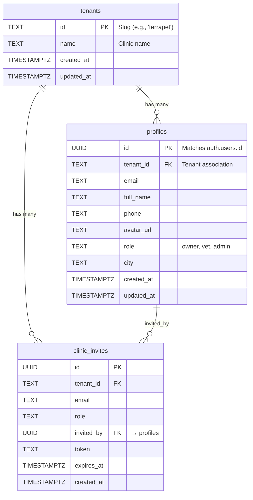

### Key Relationships

- **tenants** → **profiles**: One-to-many (clinic has staff/owners)
- **profiles** → **clinic_invites**: One-to-many (staff invites others)

---

## Pet Management

### Diagram

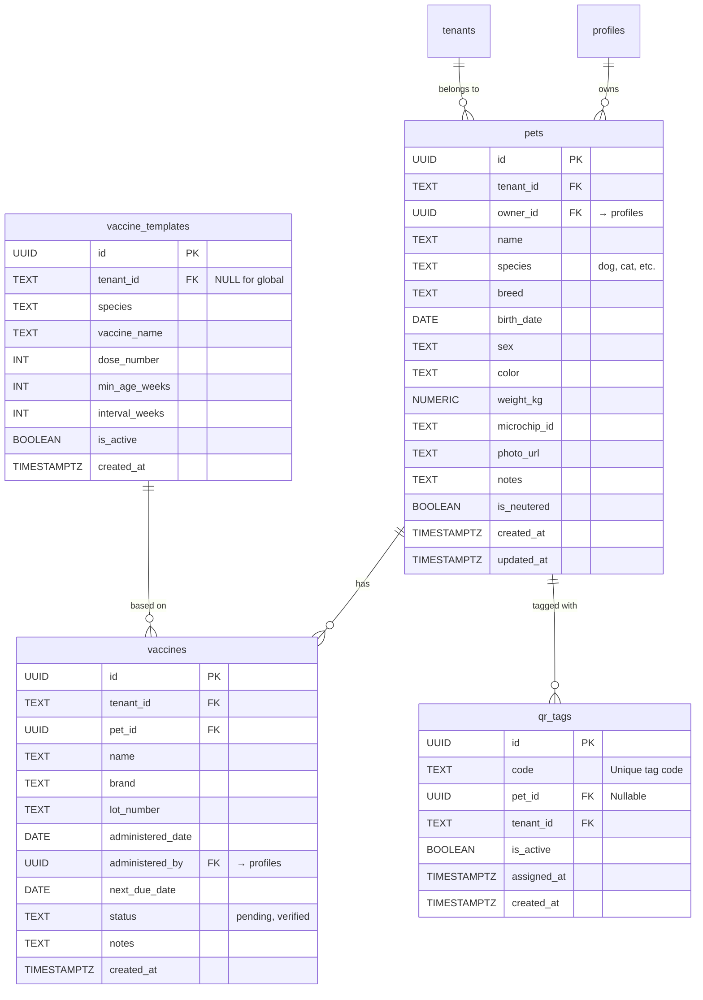

### Key Relationships

- **profiles** → **pets**: One-to-many (owner has multiple pets)
- **pets** → **vaccines**: One-to-many (pet has vaccine history)
- **pets** → **qr_tags**: One-to-many (pet can have multiple tags over time)
- **vaccine_templates** → **vaccines**: One-to-many (template used for scheduling)

---

## Clinical Domain

### Diagram

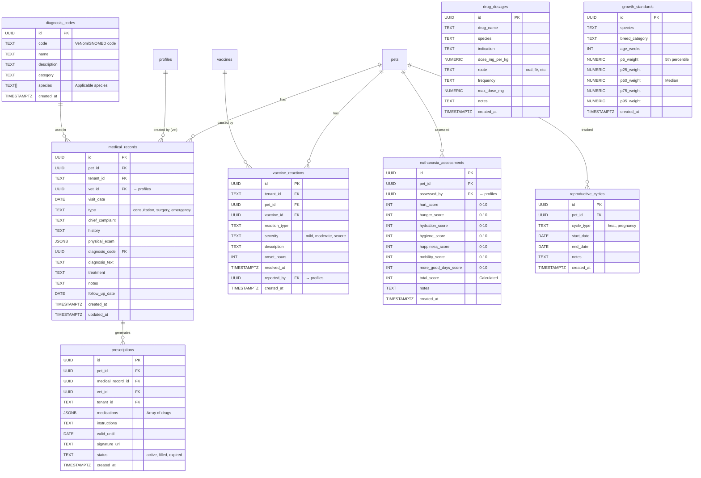

### Key Relationships

- **pets** → **medical_records**: One-to-many
- **medical_records** → **prescriptions**: One-to-many
- **diagnosis_codes** → **medical_records**: One-to-many
- **vaccines** → **vaccine_reactions**: One-to-many

---

## Scheduling & Appointments

### Diagram

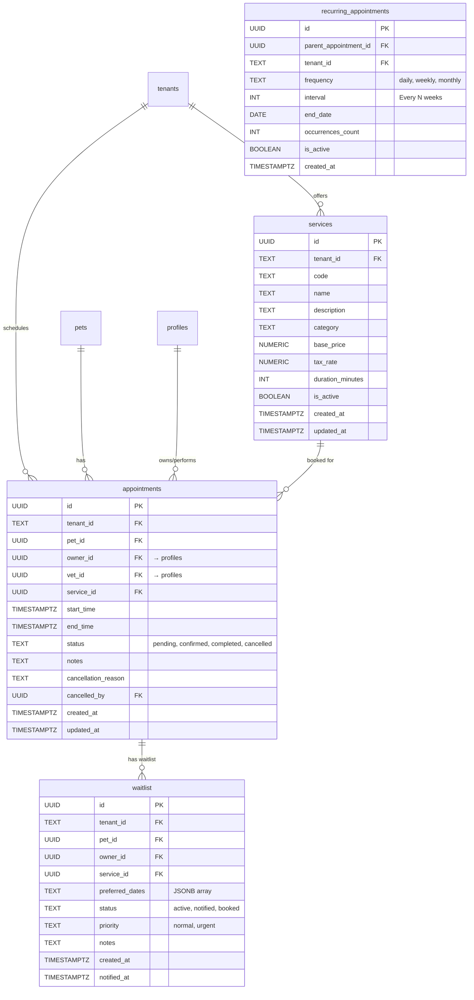

### Key Relationships

- **services** → **appointments**: One-to-many
- **pets** → **appointments**: One-to-many
- **profiles** (owner) → **appointments**: One-to-many
- **profiles** (vet) → **appointments**: One-to-many
- **appointments** → **waitlist**: One-to-many (when no slots available)

---

## Financial Domain

### Diagram

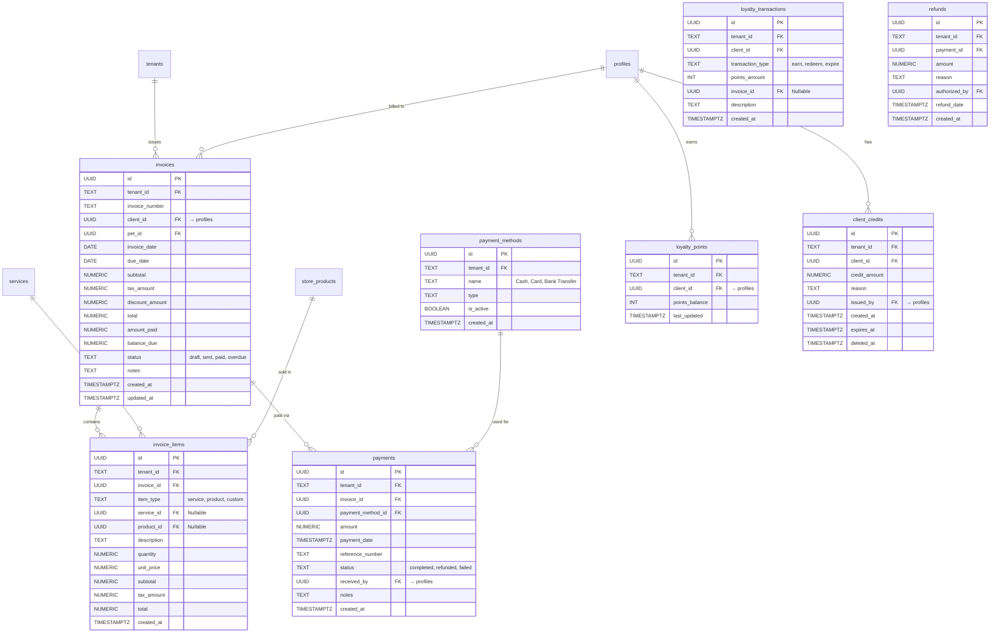

### Key Relationships

- **invoices** → **invoice_items**: One-to-many
- **invoices** → **payments**: One-to-many
- **services** / **store_products** → **invoice_items**: Many-to-one
- **profiles** → **loyalty_points**: One-to-one

---

## Inventory & Store

### Diagram

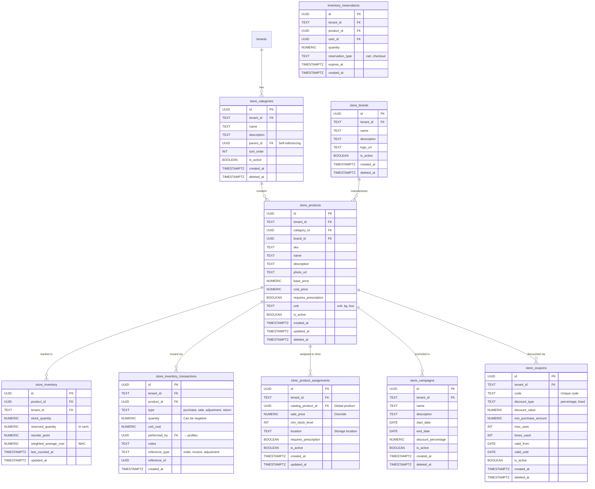

### Key Relationships

- **store_categories** → **store_products**: One-to-many (hierarchical categories)
- **store_products** → **store_inventory**: One-to-one (per tenant)
- **store_products** → **store_inventory_transactions**: One-to-many
- **store_products** → **clinic_product_assignments**: One-to-many (global catalog)

---

## Laboratory

### Diagram

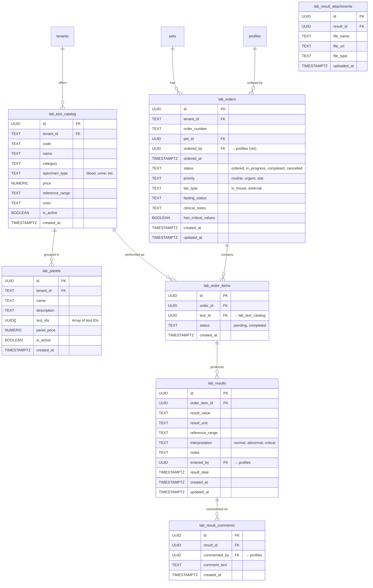

### Key Relationships

- **lab_test_catalog** → **lab_panels**: Many-to-many (tests grouped in panels)
- **lab_orders** → **lab_order_items**: One-to-many
- **lab_order_items** → **lab_results**: One-to-one

---

## Hospitalization

### Diagram

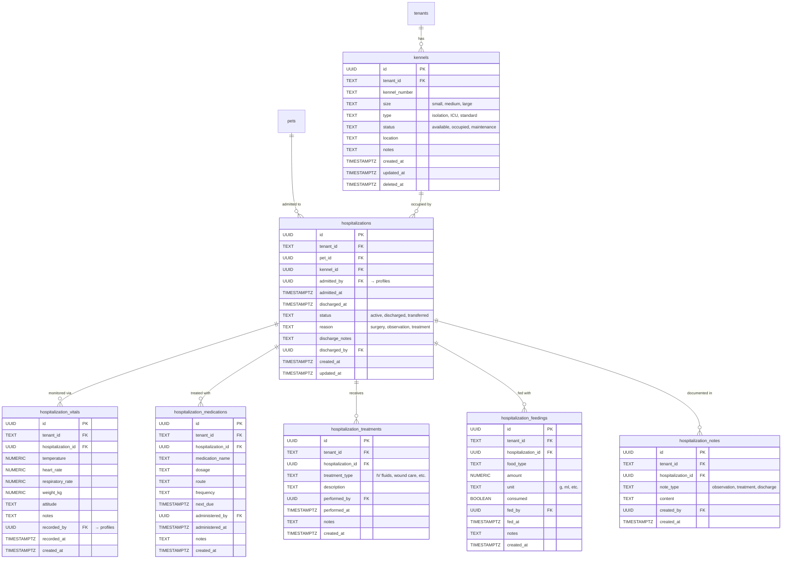

### Key Relationships

- **kennels** → **hospitalizations**: One-to-many
- **hospitalizations** → **vitals/medications/treatments/feedings/notes**: One-to-many

---

## Communications

### Diagram

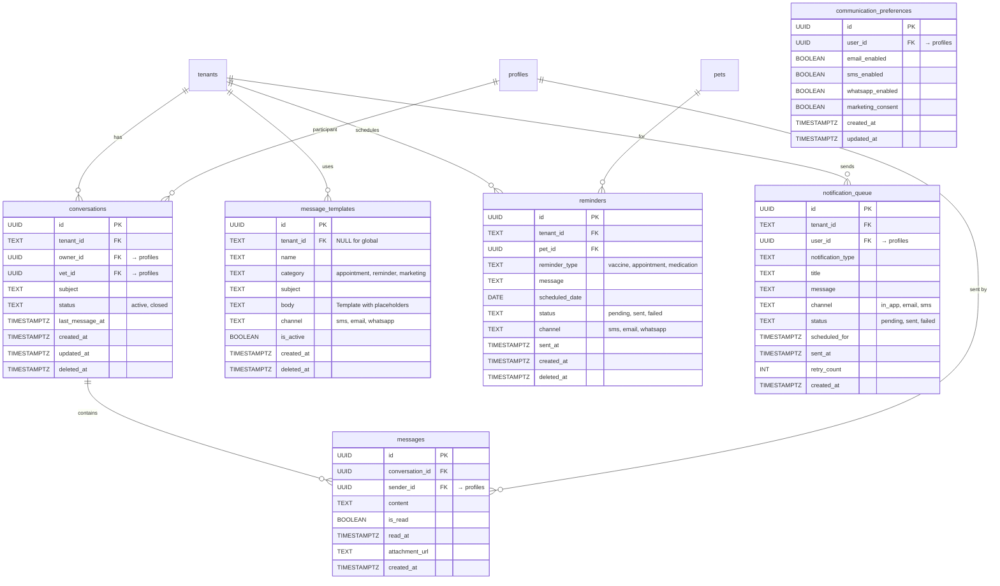

### Key Relationships

- **conversations** → **messages**: One-to-many
- **profiles** → **conversations**: Many-to-many (owner-vet)
- **message_templates** → **reminders**: Many-to-one (template used)

---

## Insurance

### Diagram

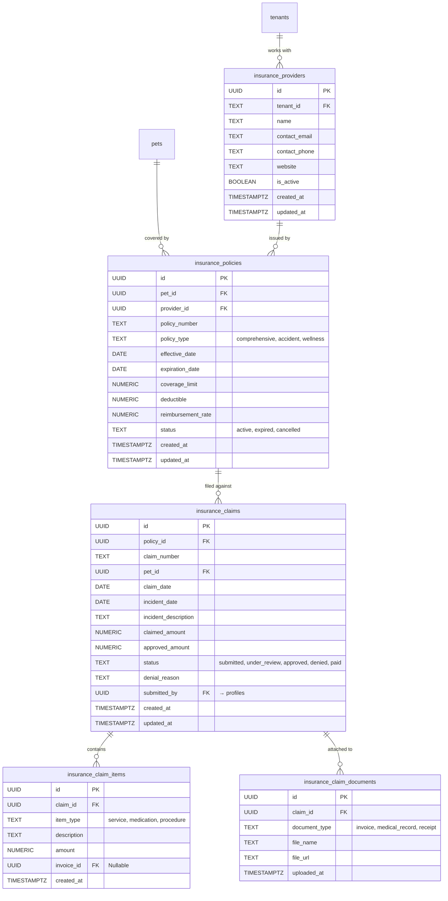

### Key Relationships

- **insurance_policies** → **insurance_claims**: One-to-many
- **insurance_claims** → **insurance_claim_items**: One-to-many
- **pets** → **insurance_policies**: One-to-many

---

## Staff Management

### Diagram

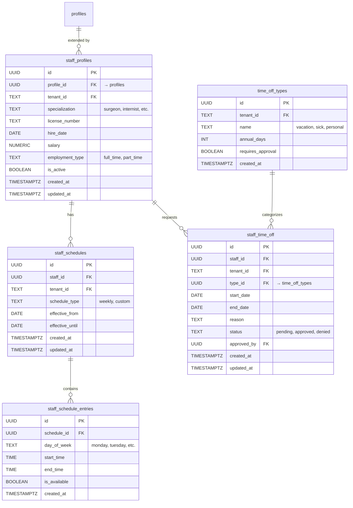

### Key Relationships

- **profiles** → **staff_profiles**: One-to-one (staff extension)
- **staff_profiles** → **staff_schedules**: One-to-many
- **staff_schedules** → **staff_schedule_entries**: One-to-many

---

## System & Audit

### Diagram

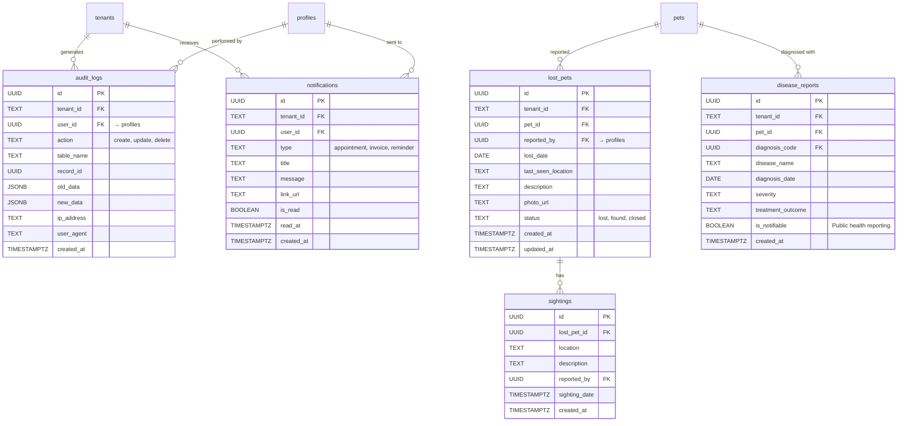

### Key Relationships

- **audit_logs**: Tracks all data changes (generic)
- **lost_pets** → **sightings**: One-to-many
- **pets** → **disease_reports**: One-to-many

---

## Full Schema Diagram

### Comprehensive Overview (Simplified)

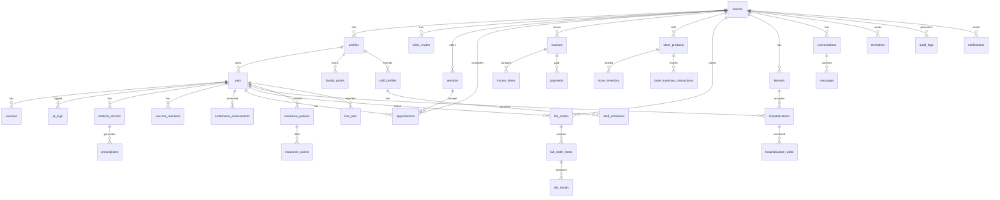

---

## Database Statistics

### Table Count by Domain

| Domain          | Table Count | Notes                               |
| --------------- | ----------- | ----------------------------------- |
| Core            | 3           | Minimal, focused                    |
| Pets            | 4           | Pet profiles + vaccines             |
| Clinical        | 20+         | Extensive medical tracking          |
| Scheduling      | 5           | Appointments + recurring + waitlist |
| Finance         | 12          | Full invoicing + loyalty            |
| Inventory       | 9+          | Dual-unit tracking, reservations    |
| Laboratory      | 7           | Orders, results, panels             |
| Hospitalization | 8           | Kennels + monitoring                |
| Communications  | 6           | Messages + reminders                |
| Insurance       | 5           | Policies + claims                   |
| Staff           | 5           | Profiles + schedules                |
| System          | 8+          | Audit + notifications               |
| **TOTAL**       | **100+**    | Complete clinic management          |

### Relationship Patterns

- **Multi-tenancy**: ALL tables have `tenant_id` foreign key to `tenants.id`
- **Ownership**: Most entities link to `profiles` (user who created/owns)
- **Pet-Centric**: 30+ tables reference `pets.id` directly
- **Soft Deletes**: 60+ tables have `deleted_at` column
- **Audit Trail**: `created_at` / `updated_at` on all tables
- **Status Fields**: 40+ tables use status enums for workflow tracking

---

## Foreign Key Constraints

### Key Cascading Rules

| Constraint                    | Action on Delete | Rationale                          |
| ----------------------------- | ---------------- | ---------------------------------- |
| `tenant_id → tenants`         | **RESTRICT**     | Prevent accidental tenant deletion |
| `pet_id → pets`               | **CASCADE**      | Remove all pet data if pet deleted |
| `profile_id → profiles`       | **SET NULL**     | Preserve data, anonymize user      |
| `invoice_id → invoices`       | **RESTRICT**     | Prevent financial data loss        |
| `product_id → store_products` | **RESTRICT**     | Maintain inventory history         |

---

## Indexes

### Performance-Critical Indexes

```sql
-- Multi-tenant isolation (on EVERY table)
CREATE INDEX idx_{table}_tenant ON {table}(tenant_id);

-- Common query patterns
CREATE INDEX idx_appointments_tenant_date ON appointments(tenant_id, start_time);
CREATE INDEX idx_invoices_tenant_status ON invoices(tenant_id, status);
CREATE INDEX idx_pets_owner ON pets(owner_id, tenant_id);
CREATE INDEX idx_medical_records_pet_date ON medical_records(pet_id, visit_date DESC);

-- Partial indexes for active records
CREATE INDEX idx_products_active ON store_products(tenant_id, category_id)
WHERE is_active = TRUE AND deleted_at IS NULL;

-- Composite indexes for dashboards
CREATE INDEX idx_appointments_tenant_status_start
ON appointments(tenant_id, status, start_time);
```

---

## Row-Level Security (RLS)

### Policy Patterns

Every table has RLS policies enforcing:

1. **Tenant Isolation**: `tenant_id = get_user_tenant()`
2. **Role-Based Access**:
   - `owner`: Own pets only
   - `vet`: All pets in clinic
   - `admin`: Everything in clinic
3. **Service Role Bypass**: Backend operations use service role

### Example Policy

```sql
-- Staff can manage all pets in their clinic
CREATE POLICY "Staff manage pets" ON pets
    FOR ALL TO authenticated
    USING (is_staff_of(tenant_id));

-- Owners can only view their own pets
CREATE POLICY "Owners view own pets" ON pets
    FOR SELECT TO authenticated
    USING (owner_id = auth.uid());
```

---

## Views & Functions

### Materialized Views

- **unified_clinic_inventory**: Combines own products + catalog products
- **clinic_stats**: Dashboard metrics (appointments, revenue, pets)

### Key Functions

| Function                                   | Purpose                            |
| ------------------------------------------ | ---------------------------------- |
| `is_staff_of(tenant_id)`                   | Check if user is staff/admin       |
| `get_user_tenant()`                        | Get current user's tenant          |
| `generate_sequence_number(prefix, tenant)` | Invoice/order numbering            |
| `adjust_inventory_atomic(...)`             | Transaction-safe inventory updates |
| `create_lab_order_atomic(...)`             | Atomic lab order creation          |
| `process_checkout_atomic(...)`             | Atomic checkout processing         |

---

## Migration Strategy

### Sequential Migrations

**94 migrations** applied in order:

1. `001_add_tenant_id_to_child_tables.sql`
2. `002_add_missing_foreign_keys.sql`
3. ...
4. `094_performance_metrics_history.sql`

### Idempotency Patterns

See `web/docs/MIGRATION_IDEMPOTENCY.md` for:

- `IF NOT EXISTS` patterns
- `CREATE OR REPLACE` for functions
- `DROP IF EXISTS` for triggers
- `DO $$ ... EXCEPTION` for constraints

---

## References

- **Schema Reference**: `documentation/database/schema-reference.md`
- **RLS Policies**: `documentation/database/rls-policies.md`
- **Migration Guide**: `web/docs/MIGRATION_IDEMPOTENCY.md`
- **Database README**: `web/db/README.md`

---

_Last updated: January 2026_
_Generated from: 94 migrations, 100+ tables, 12 domains_
